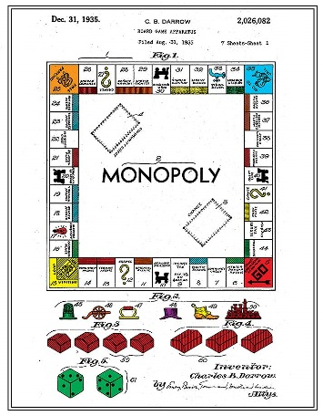
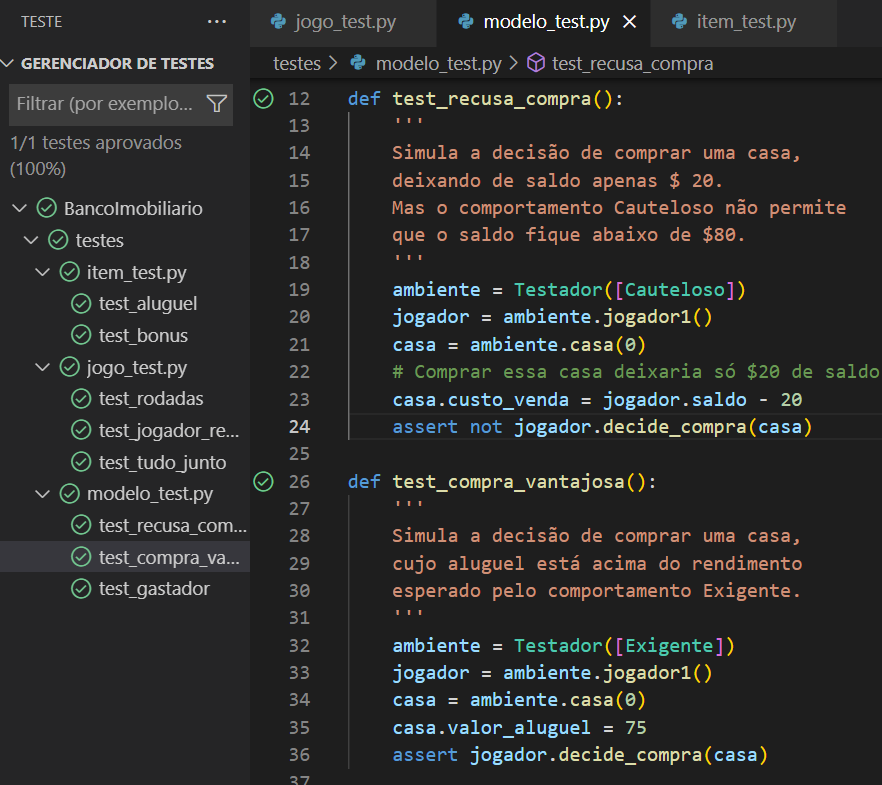

# Banco Imobiliario
Desafio para a simulação de um jogo de `Banco Imobiliário` simplificado, utilizando _**Design Patterns**_.



## Conceitos
- *Turno* é a vez de UM jogador
- *Rodada* é quando todos os jogadores já jogaram uma vez
- *Simulações* é a quantidade de partidas que o programa vai rodar

---
## Elementos

### **/modelo**

* Nesta pasta ficam os _comportamentos_ a serem **injetados** nos jogadores.
```
Um Comportamento é uma classe que contém regras para decidir a compra de uma casa pelo jogador.
```
* Existem 4 tipos de comportamento no jogo:
    * Impulsivo - Compra até ficar sem saldo;
    * Cauteloso - Só compra se sobrar saldo para pagar aluguel;
    * Exigente - Não compra casas com aluguel muito baixo;
    * Aleatório - Pode comprar ou não, dependendo do momento...
    * Ainda existe o tipo **Avarento** que serve apenas para testes (porque ele NUNCA compra nada)!

### **/regra**
* item.py - Contém os itens do jogo:
    * Jogador - Classe que representa os jogadores;
    * Propriedade - Um imóvel ocupando uma posição no tabuleiro (ou `casa`)
        * Quando um jogador para sobre uma casa sem dono ele tem opção de comprá-la (E decide compraá-la de acordo com seu comportamento);
        * Mas se a casa já tem dono, o jogador é obrigado a pagar o aluguel daquela casa
        > Se por acaso, o jogador ficar sem saldo para pagar o aluguel, ele é eliminado do jogo.
* jogo.py - Classe que controla o movimento dos jogadores, as regras de compra e venda dos imóveis e determina quem vence quando o jogo acaba.

### **/saida**
* marcador.py
    * Para ser usado como _decorator_ e registrar todos os lances do jogo num arquivo de .log
* simulacoes.py
    * Classe Simulacao: Executa cada jogo e armazena as estatísticas sobre o percentual de vitória para cada tipo de comportamento e motivo do fim de cada jogo  -- Os motivos podem ser:
        * Timeout - Quando a quantidade de rodadas ultrapassa o limtie de rodadas no jogo;
        * WO - Quando todos os jogadores são eliminados, menos um (que é o **vencedor**).

### /**testes**
 Os seguintes testes unitários estão disponíveis


* item_test.py
    * Cobrança de aluguel: O jogador que está ocupando a casa tem seu saldo diminuido e no mesmo valor que o dono da casa recebe.
    * Bônus - A cada volta completa no tabuleiro, o jogador recebe $100 de saldo.
* jogo_test.py
    * Incremento de rodadas;
    * Jogador removido - Quando o jogador é removido do jogo, todas as suas propriedades ficam sem dono.
    * "Tudo junto" - Roda uma _Simulação_ e vê se o vencedor é o jogador esperado.
* modelo_test.py
    * Recusa de compra - O comportamento **Cauteloso** só compra uma casa se sobrar $80 no saldo
    * Compra vantajosa - O comportamento **Exigente** só permite comprar uma casa se o aluguel dela for maior que $50.
    * "O gastador" - Faz a compra de várias casas
    até ficar sem saldo suficiente.

### /**util**
* gera_numeros.py - Contém as classes para Números Aleatóriso e Números para Teste -- que produzem os valores usados no resto do jogo:
    * custo de venda ou alugel de uma casa;
    * como embaralhar a sequência de jogadores;
    * se o comportamento **Aleatório** deve ou não comprar uma casa;
    * o lançamento de dados.
* testador.py - Rotinas gerais e dados para montar um ambiente de testes.

---
## Como rodar
Para executar o jogo, use:
> `python ./monopoly`

ou o equivalente no seu sistema operacional.
